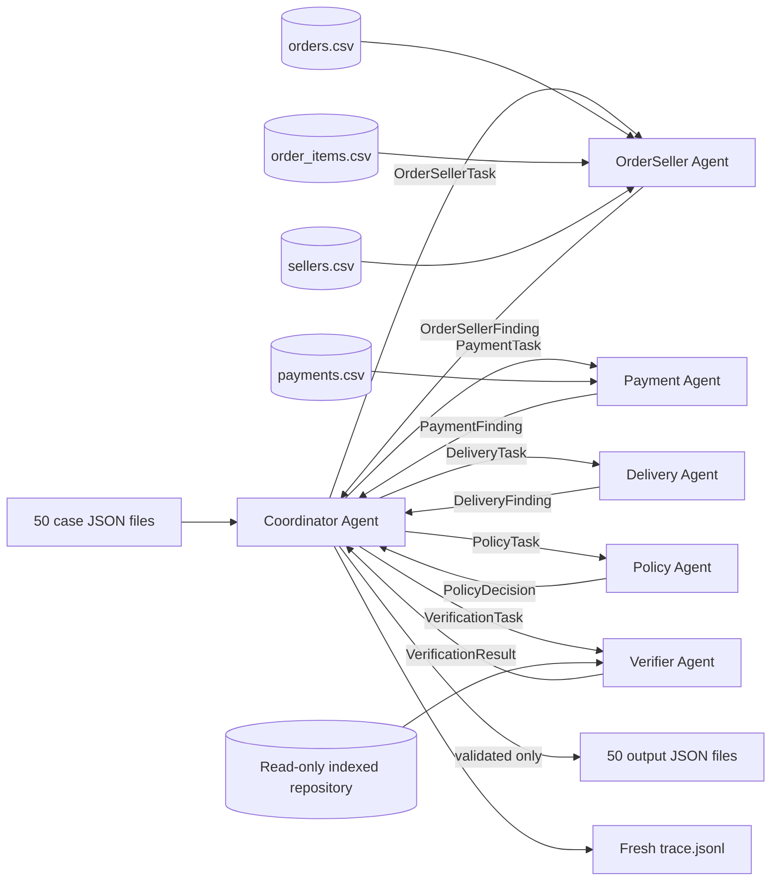

# Deterministic Multi-Agent Dispute Resolution Architecture

## System overview

The system processes the 50 `EC_POLICY_V1` cases with six autonomous Python
components. Every decision comes from Olist CSV facts and explicit policy rules.
Agents exchange immutable dataclass messages; no free-form prompt or hidden rule
is used.

Llama 3.1 8B Instruct on Groq is the declared compatible reference model. Its
8B parameter count is below the assignment's 10B limit, but
`MODEL_INVOCATION_ENABLED` is `false`. No LLM is called because the task is
fully deterministic. The actual execution engine is Python.

## Agent responsibilities and access

| Agent | Computation | Data access |
|---|---|---|
| Coordinator | Dispatch, collection, output assembly, verification gate | Typed findings only |
| OrderSeller | Status, items, sellers, item/freight totals, per-item handoff lateness | Orders, items, related sellers |
| Payment | Payment rows, total, split detection, reconciliation | Payments plus typed financial totals |
| Delivery | Delivery lateness, aggregate handoff status, violating sellers | OrderSellerFinding only |
| Policy | Exact six-rule priority, cause, party, refund, action | Typed domain findings only |
| Verifier | Schema, enums, IDs, evidence, limits, finance, policy consistency | Candidate, findings, read-only indexes |

The repository first reads the claimed order IDs, then scans each relevant CSV
once. It retains only related orders, items, payments, customers, sellers, and
products, and verifies the required foreign records exist. Original CSV files
are never changed.

## Handoff and policy flow

Each request and response is a frozen dataclass. The Coordinator calls the
OrderSeller and Payment agents, gives the resulting order facts to Delivery,
and sends all three findings to Policy. Policy evaluates the rules in this
fixed order:

1. canceled order paid
2. unavailable order paid
3. late delivery caused by seller handoff
4. late delivery caused by logistics
5. reconciled split payment
6. unsupported late claim

Missing dates remain unknown. Money uses `Decimal`, final values are rounded to
two places, and payment reconciliation uses an inclusive 0.10 BRL tolerance.

## Validation and publication

The Coordinator assembles a candidate but cannot publish it directly. The
Verifier reconstructs expected entity/evidence IDs and financial values from
the indexed data, checks the exact output shape and enums, and confirms the
policy result. A failure aborts the run with a nonzero exit. All 50 candidates
must validate before any output is published.

On success, output files are written by atomic replacement. The output folder
contains only `EC_001.json` through `EC_050.json`.

## Trace generation

Every agent request and response produces a JSONL event containing a stable
sequence number, case ID, sender, receiver, message type, and structured
payload. The trace is assembled during the real run and replaces
`logging/trace.jsonl`; it is never appended. Five request/response pairs per
case produce 500 events for the official dataset.
